# 🧩 STM32L0 Zephyr LED + Watchdog + Thread Health Monitor
[](https://github.com/ramirezramiro/stm32-zephyr-watchdog-threads/actions/workflows/native-sim.yml)
**Board:** NUCLEO-L053R8 | **RTOS:** Zephyr 4.2.x | **Language:** C  

A robust demo integrating LED control, heartbeat threads, and a fully managed **STM32 Independent Watchdog (IWDG)** under Zephyr RTOS — showcasing reliable health monitoring and safe watchdog feeding.

---

## Consulting & Attribution

The “stm32-zephyr-watchdog-threads ramirezramiro — STM32L0 Zephyr LED + Watchdog + Thread Health Monitor” project ships a production-ready STM32L0 watchdog, persistence, and recovery stack that routinely cuts Zephyr bring-up time from weeks to days. If you reuse it, please cite the full project name, keep the included NOTICE file, and consider linking back to this repository. For professional inquiries, open a GitHub issue or connect via [LinkedIn](https://www.linkedin.com/in/ramiro-ramirez-tw/).

**Highlights:**
- Manual IWDG takeover with structured telemetry and persistence
- Safe-mode recovery flow with supervisor health gating
- Native `native_sim` test suites for fast CI regression
- Available for custom RAM/watchdog tuning — see contact below.

**Need integration help or custom features?** Open a GitHub issue or connect via [LinkedIn](https://www.linkedin.com/in/ramiro-ramirez-tw/).


## 🧠 Debugging Summary

### 🛠 STM32L0 IWDG takeover

Our very first hurdle was reclaiming the STM32L053R8 Independent Watchdog (IWDG). Unlike many STM32 families, this part exposes the watchdog under the `iwdg` alias and Zephyr eagerly arms it during boot. The result was a week of instant resets and opaque logs such as:

```text
WDT install failed: -12
WDT channel already installed; continuing
```

The breakthrough was to keep the Devicetree node present so the peripheral clocks stay enabled, but prevent Zephyr from touching it before our application runs:

```dts
/* boards/nucleo_l053r8.overlay */
&iwdg {
    status = "okay";
};
```

```conf
# prj.conf
CONFIG_WDT_DISABLE_AT_BOOT=y
```

With those guards in place, `watchdog_ctrl_init()` installs the single STM32 timeout channel, sets the boot timeout we want, and performs the first feed from user space. From that point on every retune and feed happens on our terms.

### Iterations after IWDG control

The project then went through three additional rounds of troubleshooting:

1. **Boot-time watchdog race.** Even after taking ownership, the supervisor needed a grace period so the LED/heartbeat threads could start before the first feed. We added a configurable boot timeout and retune window so the dog stays relaxed during initialization.
2. **Persistent telemetry robustness.** Storing reset history in NVS surfaced flash-layout and locking issues. We introduced a dedicated partition, explicit mount sequencing, and helper hooks so the supervisor can clear counters once the system is healthy again.
3. **Health gating and recovery.** Early versions fed the watchdog even when the LED/heartbeat threads stalled. The supervisor now tracks last-seen timestamps, refuses to feed when stale, and triggers a safe warm reboot through the recovery thread.

### ✅ Resolution Highlights
- Devicetree overlay keeps the IWDG exposed while deferring ownership to the application:

  ```dts
  /* nucleo_l053r8.overlay */
  &iwdg {
      status = "okay";
  };
  ```

  ```conf
  # prj.conf
  CONFIG_WDT_DISABLE_AT_BOOT=y
  ```

- `watchdog_ctrl_init()` installs the single STM32 channel, matches the boot timeout, and primes the feed so later retunes can reuse the same handle without `-12` errors.
- `persist_state.c` mounts NVS lazily, records reset storms, and exposes retune overrides that survive power cycles.
- `supervisor.c` enforces a grace window, clears counters after the first successful retune, and escalates to `recovery.c` when health signals stall.
- Native `native_sim` suites recreate these flows without hardware, giving us fast regression coverage for persistence and supervisor control logic.

## ⚙️ Key Lessons

| Area                   | Lesson                                                                                       |
| ---------------------- | -------------------------------------------------------------------------------------------- |
| **Devicetree**         | `"okay"` nodes auto-instantiate hardware; disable boot init to control peripherals manually. |
| **Watchdog Driver**    | STM32 IWDG supports **only one timeout channel** — reinstall attempts fail.                  |
| **Memory Tuning**      | With 8 KB SRAM, thread stacks must be tightly managed.                                       |
| **Kconfig Discipline** | Wrong data types (`y` instead of numeric) abort builds — check `prj.conf` carefully.         |
| **Startup Race**       | Add a brief “grace window” before enforcing watchdog feeds during early scheduling.          |

## 🚀 Recent Enhancements

- Persistent watchdog telemetry stored in NVS keeps a cross-boot history of reset storms and automatically clears once fallback is exited.
- NVS initialisation now retries flash open/mount operations and emits `EVT,PERSIST,…` logs so storage faults are visible instead of silent.
- A unified health thread now drives the LED blink, issues heartbeat notifications, and produces `EVT,HEARTBEAT,OK,…` telemetry without spawning extra stacks.
- Structured logging helpers (`LOG_EVT*`) emit compact `EVT,<tag>,<status>,key=value…` lines that are straightforward to parse or diff.
- Safe-mode escalation slows the LED, schedules an optional warm reboot via `CONFIG_APP_SAFE_MODE_REBOOT_DELAY_MS`, and records each recovery milestone without relying on the system workqueue (prevents stack overflows during long safe-mode sessions).
- Watchdog initialisation failures now trigger `EVT,RECOVERY,WATCHDOG_INIT_FAIL` and an immediate warm reboot instead of leaving the board in an undefined state.
- An optional UART watchdog CLI can be enabled with `CONFIG_APP_ENABLE_UART_COMMANDS=y` when RAM budgets allow, providing `wdg?`, `wdg <ms>`, and `wdg clear` commands.
- A manual recovery request API lets the UART CLI or tests flag intentional reboots with `RECOVERY_REASON_MANUAL_TRIGGER` telemetry.
- LED behaviour is now explained for the common “why did it start blinking slowly?” question—slow blink = safe mode, steady blink = healthy.

## 🧩 System Architecture

```text
stm32-zephyr-watchdog-threads/
├── .github/
│   └── workflows/
│       └── native-sim.yml
├── .gitignore
├── boards/
│   ├── README.md
│   ├── nucleo_l053r8.overlay
│   └── nucleo_l053r8_app.overlay
├── build/  (ignored)
├── CMakeLists.txt
├── Kconfig
├── LICENSE
├── NOTICE
├── docs/
│   ├── architecture.md
│   ├── persist_state.md
│   ├── recovery.md
│   ├── supervisor.md
│   ├── testing.md
│   ├── uart_commands.md
│   └── watchdog_ctrl.md
├── prj.conf
├── README.md
├── src/
│   ├── log_utils.h
│   ├── main.c
│   ├── persist_state.c
│   ├── persist_state.h
│   ├── recovery.c
│   ├── recovery.h
│   ├── supervisor.c
│   ├── supervisor.h
│   ├── uart_commands.c
│   ├── uart_commands.h
│   ├── watchdog_ctrl.c
│   └── watchdog_ctrl.h
├── tests/
│   ├── persist_state/
│   │   ├── CMakeLists.txt
│   │   ├── app.overlay
│   │   ├── prj.conf
│   │   ├── testcase.yaml
│   │   └── src/main.c
│   ├── supervisor/
│   │   ├── CMakeLists.txt
│   │   ├── prj.conf
│   │   ├── testcase.yaml
│   │   └── src/main.c
│   └── README.md
└── west.yml
```


## ⏱️ Timing Diagram (ASCII Waveform)

Below are two timing views: **Normal Operation** (periodic feeds keep the IWDG happy) and **Failure Scenario** (missed feeds cause a reset).

### Normal Operation (WDT=8 s, boot grace=3 s, Heartbeat=1 s)
Time (s):     0    1    2    3    4    5    6    7 | 8    9   10   11   12   13   14   15 | 16
               |----|----|----|----|----|----|----| |----|----|----|----|----|----|----| |
Boot grace:   [=======  supervisor grace window  =======]--------------------------------->
LED alive:     _/‾\_/‾\_/‾\_/‾\_/‾\_/‾\_/‾\_/‾\_/  _/‾\_/‾\_/‾\_/‾\_/‾\_/‾\_/‾\_/‾\_  (≈500 ms)
HB alive:      ____|‾‾‾‾|____|‾‾‾‾|____|‾‾‾‾|____|‾|____|‾‾‾‾|____|‾‾‾‾|____|‾‾‾‾|____|‾
Supervisor:    grace feed^    grace feed^    | healthy feed^    healthy feed^    |
WDT window:   [========================== 8 s ==========================] [== 8 s ==]
Outcome:      Watchdog is refreshed in grace and steady state → system runs continuously.

### Failure Scenario (heartbeat stalls after t = 5 s)
Time (s):     0    1    2    3    4    5    6    7 | 8    9   10
               |----|----|----|----|----|----|----| |----|----|
Boot grace:   [=======  supervisor grace window  =======]------------------------->
LED alive:     _/‾\_/‾\_/‾\_/‾\_/‾\_/‾\_/‾\_/‾\_/ _/‾\_/‾\_/‾\_/‾\_/‾\_/‾\_/‾\_/‾\_
HB alive:      ____|‾‾‾‾|____|‾‾‾‾|____|‾‾‾‾|__________ (stalls → no fresh marks)
Supervisor:    grace feed^    grace feed^         X heartbeat stale → refuse feed
WDT window:   [========================== 8 s ==========================]
Outcome:      ~8 s after the last feed the watchdog expires → **MCU warm reset**.

Legend

Heartbeat: 1 s periodic log + health mark from heartbeat_thread.

LED Blink: ~500 ms toggles from led_thread (visual liveness).

WDT Window: The configured IWDG timeout (e.g., 8000 ms).

WDT Feed (^): Performed only when both health flags are set (gatekeeper logic).

Reset: If no feed occurs within the WDT window, the independent watchdog resets the MCU.

## 💡 Runtime Behavior

✅ Stable Heartbeat alive logs confirm watchdog feeding loop.

✅ Verified manual timeout control via watchdog_ctrl_init(timeout_ms).

✅ Verified reset detection via log_reset_cause().

⚡ Example test: watchdog_ctrl_init(1500) → system resets in ≈ 1.5 s.

### LED Cheat Sheet (NUCLEO-L053R8)

- **Normal mode (everything healthy):** the single on-board LD2 LED blinks every ~500 ms. That’s the firmware’s way of saying “all threads are happy and the watchdog is being fed.”
- **Safe mode (after repeated watchdog resets):** the same LED slows down to a 1 Hz blink. The color doesn’t change; this board only has a green LED, but the slower pace is your visual clue that the firmware is running with wider watchdog timeouts and limited features. After `CONFIG_APP_SAFE_MODE_REBOOT_DELAY_MS` the recovery thread logs `EVT,RECOVERY,SAFE_MODE_TIMEOUT` / `EVT,RECOVERY,SAFE_MODE_REBOOT,...` and performs the warm reboot unless you have cancelled the timer.
- **Why not red?** NUCLEO-L053R8 ships with a single-colour LED. To show color-coded states you’d need to add an external RGB LED and drive it from spare GPIOs or another interface. For the built-in hardware, timing patterns are the most reliable way to signal status.

### SRAM Budget

- The STM32L053 only offers 8 KB of SRAM; the default stack sizes (main 1568 B, ISR 1024 B, health 704 B, supervisor 672 B, recovery 512 B) are tuned to keep the firmware stable while still leaving a few hundred bytes free.
- If you enable optional features like the UART command thread or add new peripherals, revisit these stack values with Zephyr’s thread analyzer; there isn’t much room to grow without trimming other workloads.
- I offer consulting to profile stack usage, prune features, and deliver tailored builds that hit your RAM or watchdog constraints regarding Nucleo L053R8. Reach out through a GitHub issue or [LinkedIn](https://www.linkedin.com/in/ramiro-ramirez-tw/) to discuss scope.

## ⚡ Quick Start (Full Workflow)

Follow this sequence to go from setup to live serial monitoring:

1. Windows Powershell (admin rights)

This exposes the STM32 (ST-Link) to our WSL distribution.

   - Confirm `usbipd` is updated (v2.3 or newer) so hot-plug forwarding is stable.
   - If multiple boards are connected, take note of the BUSID you want; later steps assume only one ST-Link is shared into WSL.
   - Consider saving these commands in a PowerShell script so you can attach/detach with a single shortcut.

```bash
PS C:\OS\system32> usbipd list
Connected:
BUSID  VID:PID    DEVICE                                                        STATE
1-3    0123:456b  ST-Link Debug, USB Mass Storage Device, STMicroelectronic...  Shared
```
```bash
PS C:\OS\system32> usbipd attach --wsl --busid 1-3
usbipd: info: Using WSL distribution 'Ubuntu-22.04' to attach; the device will be available in all WSL 2 distributions.
usbipd: info: Detected networking mode 'nat'.
usbipd: info: Using IP address 168.88.888.1 to reach the host.
```
2. WSL (Visual Studio Terminal)

We must run the virtual environment (.venv) to be able to use west for flashing.

   - `source .venv/bin/activate` keeps all Zephyr Python tools aligned with the version in `~/zephyrproject`.
   - If you maintain the app outside of `~/zephyrproject`, export `ZEPHYR_BASE` before invoking west.
   - Keep this terminal open throughout development; closing it will drop the forwarded USB connection.

Check if your device is reflected in WSL environment as follows

```bash
your-user@device-name:$ cd ~/zephyrproject
your-user@device-name:~/zephyrproject$ source .venv/bin/activate
(.venv) your-user@device-name:~/zephyrproject$ cd ~/zephyr-apps/stm32-zephyr-watchdog-threads
(.venv) your-user@device-name:~/zephyr-apps/stm32-zephyr-watchdog-threads$ lsusb
Bus 001 Device 067: ID 0123:456b STMicroelectronics ST-LINK/V2.1
```

If the device is shown after using lsusb, we can move on to build and flash our project.

3. Optional host-only smoke test

   - Run `west build -b native_sim tests/persist_state` to confirm multilib support and Python deps before touching hardware.
   - Follow with `west build -t run --build-dir build/tests/persist_state` if you want to see the persistence suite pass on your workstation.

## 🧰 Build & Flash

```bash
(.venv) your-user@device-name:~/zephyr-apps/stm32-zephyr-watchdog-threads$ west build -b nucleo_l053r8 -p always .
(.venv) your-user@device-name:~/zephyr-apps/stm32-zephyr-watchdog-threads$ west flash -r openocd
```

Ensure UART @ 115200 bps and CONFIG_LOG_MODE_IMMEDIATE=y for real-time output.

> 💡 **UART CLI RAM note:** `CONFIG_APP_ENABLE_UART_COMMANDS=y` launches the `uart_cmd` helper thread with a 288-byte stack plus thread metadata (~96 bytes). Budget roughly 400 bytes of additional SRAM when enabling it on the 8 KB STM32L0.

## 🧪 Testing Snapshot

- Native `native_sim` suites cover persistence (`tests/persist_state`) and
  supervisor logic (`tests/supervisor`) for fast regression checks without
  hardware.
- From the project root:

  ```bash
  source $ZEPHYR_BASE/zephyr-env.sh
  west build -b native_sim -p always tests/persist_state --build-dir build/tests/persist_state && west build -t run --build-dir build/tests/persist_state
  west build -b native_sim -p always tests/supervisor --build-dir build/tests/supervisor && west build -t run --build-dir build/tests/supervisor
  ```
- Need the full workflow or troubleshooting tips? See `docs/testing.md`. For
  exhaustive suite notes, verification commands, and log examples, consult
  `tests/README.md`.

## 💡 Real-World Applications

The current feature set—manual IWDG ownership, persistent reset fingerprints, structured telemetry, safe-mode recovery, and optional UART overrides—aligns with any Zephyr deployment that needs to heal itself and leave a paper trail.

| Domain / product slice       | Representative deployment                                          | Relevant features in this repo                                                          |
| ---------------------------- | ------------------------------------------------------------------ | --------------------------------------------------------------------------------------- |
| 🏭 **Industrial IoT gateways** | Modbus/MQTT concentrators on factory floors                       | IWDG takeover prevents uncontrolled resets; NVS history flags brownout-driven storms    |
| 🚜 **Smart agriculture nodes** | Solar soil probes or irrigation controllers with flaky power      | Supervisor grace/retune logic tolerates cold boots; safe mode schedules auto-recovery   |
| 🧠 **Medical wearables**        | BLE fall detectors or dosage reminders that must never hang      | Dual-heartbeat supervision plus structured `EVT,…` logging for compliance traceability  |
| 🛰 **UAV / aerospace payloads** | Secondary flight computers and telemetry subsystems               | Watchdog refusal on stale signals avoids feeding dead loops; recovery thread reboots    |
| 🏠 **Smart energy / HVAC**      | Home energy meters or climate controllers with remote updates    | Persistent overrides let installers widen timeouts via UART without reflashing firmware |
| 🔒 **OT security gateways**     | Edge devices bridging secure enclaves and legacy equipment       | Structured logs + reset history aid intrusion detection; watchdog enforces trusted path |

Any deployment that depends on cooperative Zephyr threads, has limited on-site access, or needs a forensic trail of watchdog events can reuse this architecture with minimal tweaks.

## ⚙️ Configuration and Build Flowchart

```mermaid
flowchart TD
  user[User CLI:<br/>`west build -b nucleo_l053r8`] --> cfg{Configure}

  subgraph Configure
    cfg --> cmake[CMake 'root CMakeLists.txt']
    cmake --> kconfig[Kconfig merge:<br/>board defconfig + prj.conf → autoconf.h]
    cmake --> dts[Devicetree compile:<br/>board.dts + overlays → zephyr.dts/zephyr.h]
    cmake --> tests[tests/* CMakeLists:<br/>reuse app Kconfig via KCONFIG_ROOT]
    kconfig --> headers[Generate headers:<br/>autoconf.h, kernel includes]
    dts --> headers
    headers --> ninjaprep[Generate Ninja build files]
  end

  subgraph Build
    ninjaprep --> ninja[Ninja]
    ninja --> compile[Compile & link<br/>app + Zephyr kernel + modules]
    compile --> artifacts[Artifacts:<br/>zephyr.elf / hex / bin,<br/>zephyr.dts, handler.log, map]
  end

  cmake -. reads .-> cmakelists[CMakeLists.txt]
  kconfig -. reads .-> prjconf[prj.conf + Kconfig]
  dts -. reads .-> overlays[`boards/*.overlay`<br/>+ test overlays]
  ninja -. compiles .-> sources[src/*.c<br/>+ testsuite sources]
  cfg -. manifest .-> manifest[west.yml]
```



## 🔩 Flash and Runtime Flowchart


## 📡 Telemetry & Safe Mode Notes

- **Structured logs:** every milestone uses `EVT,<tag>,<status>,kv…` so you can diff serial captures or feed them into log processors (examples above).
- **Persistent counters:** `persist_state` stores total and consecutive watchdog resets; the supervisor clears them once a healthy retune succeeds, letting you detect storms post-mortem.
- **Safe mode:** hitting `CONFIG_APP_RESET_WATCHDOG_THRESHOLD` consecutive resets slows the LED, widens the watchdog window, and optionally schedules a warm reboot after `CONFIG_APP_SAFE_MODE_REBOOT_DELAY_MS`.
- **UART watchdog CLI:** when `CONFIG_APP_ENABLE_UART_COMMANDS=y`, technicians can run `wdg?`, `wdg 4000`, or `wdg clear` over 115200 baud UART without reflashing. Expect ~400 B extra SRAM consumption.
- **Native simulation suites:** `tests/persist_state` validates NVS behaviour; `tests/supervisor` stubs hardware to exercise retune and recovery logic. Run them with `west build -b native_sim …` during CI.

## 📁 Version Control Hygiene

The repository includes a top-level `.gitignore` that keeps transient build products and local environment files out of version control:

- `build/` — Ninja build tree for both hardware and native_sim targets
- `zephyr/`, `modules/`, `tools/` — west-managed checkouts that the CI workflow fetches on demand
- `__pycache__/`, `*.pyc` — Python bytecode caches
- `.vscode/`, `.idea/`, `.DS_Store` — common IDE/OS metadata
- `*.swp`, `*.log` — temporary editor or debug files

This keeps the repo clean for reviewers while still allowing personal tooling during development.

## 📝 Under Review

- The GitHub Actions native_sim workflow (`.github/workflows/native-sim.yml`) is currently red while we refine the CI bootstrap. Check the latest Actions run for logs; contributions that restore a green badge are welcome.

## References

| Topic / Document                                     | Section / Link                         | Key Insight                                                                                   |
| ---------------------------------------------------- | -------------------------------------- | --------------------------------------------------------------------------------------------- |
| ST RM0367, STM32L053 Reference Manual                 | Section 20 Independent Watchdog               | IWDG runs from 37 kHz LSI; prescaler & reload lock once started—no live retune possible.       |
| Zephyr Watchdog API docs                             | docs.zephyrproject.org/latest          | Explains watchdog channel semantics and why `CONFIG_WDT_DISABLE_AT_BOOT` hands control to app. |
| Zephyr Logging Subsystem                             | docs → Subsystems → Logging            | Using LOG_MODE_IMMEDIATE + custom `LOG_EVT*` macros yields deterministic, parseable telemetry. |
| Zephyr NVS Storage Guide                             | docs → Subsystems → Storage → NVS      | Describes flash partitioning and why we lazily mount before accessing persistent counters.     |
